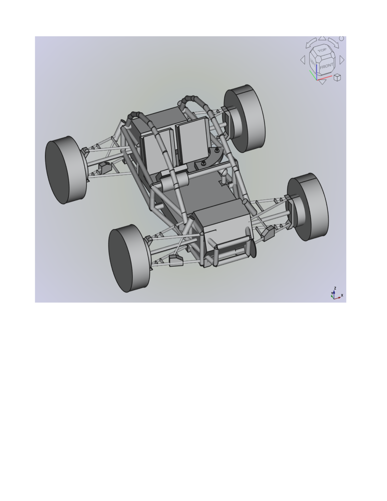

# GM_Vehicle_Module for Freecad
A FreeCAD Workbench supporting the creation of virtual and real ground mobile vehicles (wheeled).

# FreeCAD GM Vehicle Workbench
                          

**Welcome to FreeCAD GM_Vehicle!**

## Introduction
GM_Vehicle ModuleFreeCAD is an Opensource workbench for [FreeCAD](https://www.freecadweb.org). The module/workbench supports ground mobile vehicle design by providing several tools commonly used in vehicle architecture, performance, function and vehicle useability.

This major version employed the FreeCAD Workbench template found at <https://github.com/FreeCAD/freecad.workbench_starterkit>.

## Contents
- [Features](#features)
- [Install](#install)
- [Usage](#usage)
- [Tutorials](#tutorials)
- [Roadmap](#roadmap)
- [Discussion/Feedback](#discussionfeedback)
- [Bugs/Enhancements](#bugsenhancements)
- [Authors](#authors)

## Features
It currently offers the following tools:

1> Create a virtual land based vehicle suitable support rendering in an actual assembly format.

2> Links to Cascadia Motion EVBot allowing the creation of dynocharts for electric vehicle desing.

3> Links to Abbottanp.com where the discussion/analysis is presented for GM vehicles suitable for weapons system platform missions
4> Links to MotorMatchup.com to allow visualization of EV and ICE vehicle performance as sepcified by a desginer.

5> Supports the rendering of EV GM_vehilces within the FreeCAD environment.

6> Facilitates the "feedback loop" between FreeCAD rendered EV designs, EV component desgin/modifications, visualiztion of performance under various surface and weather condiitons.

TBD

## Install

This workbench/module is currently only available as in a private GITHUB repositoty.

This workbench will eventually be available for download via the FreeCAD [Addon Manager].  It will also be available for manual downloading to the designer's Mod folder in the disigner's local FreeCAD environment.  See https://www.youtube.com/watch?v=NXN7TOg3kj4  or/and https://www.youtube.com/watch?v=cYevV8zy5sM  for instructional videos on FreeCAD installation and installing workbenches.

## Usage

Documentation for this workbench is available on the [Vehicle Workbench wiki page] TBD

## Tutorials

* Official Vehicle Workbench Tutorial TBD
* Four "useful" examples are provided to allow a rapid movement down the learning curve.
* Six "quickstart" project templates are provided to aid the designer in overcoming the initial learning inertia.

## Roadmap

There are many tools and features which will be implemented in this module:

 - Wiki documentation
 - Tutorials
 - Vehicle desgin
 - Vehicle rolling resistance
 - Vehicle performance curves/plots
 - TBD

## Discussion/Feedback

Discuss bugs, feedback, thoughts etc.. on the official [FreeCAD forum thread](https://forum.freecadweb.org/

## Bugs/Enhancements

Please open tickets in the 
:: Concerning Vehicle Module ==>> TBD (https://github.com/FreeCAD/freecad.vehicle/issues)
:: Concerning Ship Module[issue queue]https://github.com/FreeCAD/freecad.ship/issues

## Authors
Vehicle Workbench Module Team
 - Lucca. Uzzo <luzzo@abbottanp.com> (Abbottanp Project Manager)
 
 Ship Module Team
 - Jose Luis Cercós Pita <jlcercos@gmail.com>
 - Juan Manuel Muñoz-Godin (Vehicle resistance Holtrop and Amadeo tools)
 - Antonio Souto-Iglesias (Advisor of Juan Manuel Muñoz-Godin)
 
 Chassis Module Team
 - Daniel Wood <https://github.com/dubstar-04> Chassis Module architet

 FreeCAD Gear Team
  - looooo lorenz <https://github.com/looooo/freecad.gears> Owner of repository
  - Syres916 Recent contributor

 
